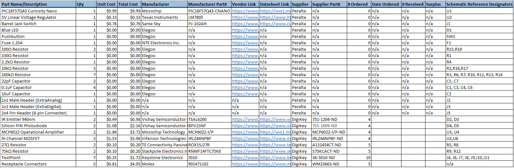

## Overview

This page shows a spreadsheet of all physical components used in the design of the Distance-Sensing Subsystem. The table includes the manufacturer name/part number of each component, how many are needed, how they are sourced, how many are ordered, and the reference designator matching the symbol on the circuit schematic. The Bill of Materials ensures that all parts are accounted for/able to be acquired and that the total cost of all materials stays within the budget of the project.

## Bill of Materials

The Bill of Materials as a Microsoft Excel file is available to download [here](EGR304-DistanceSensingSubsystemBOM.xlsx).
