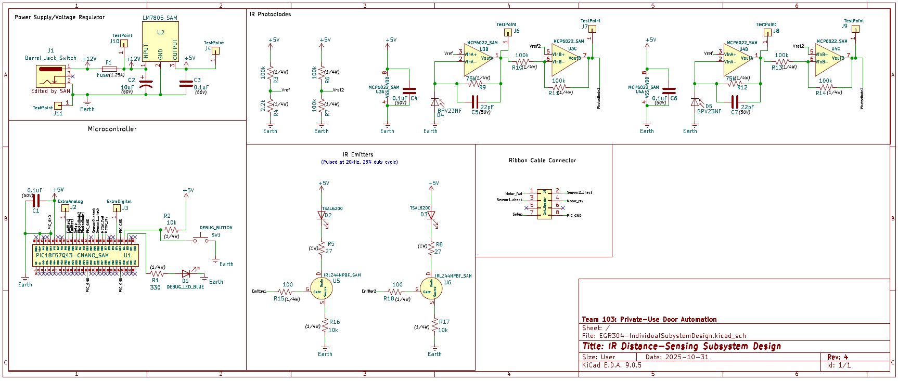

## Overview

This page shows the schematic of the IR Distance Sensors Subsystem. The different sections of the schematic show different "modules" of the whole subsystem. As labeled, the modules include the Power Supply/Voltage Regulator providing power to all components, the 8-pin ribbon wire connecter for connection between subsystems, the filtered and amplified distance sensors, and the microcontroller handling logic and communication.

## Schematic PNG

{style width:"350" height:"300;"}

## Resouces

The schematic as a PDF download is available [*here*](EGR304-IndividualSubystemDesign.pdf), and the Zip folder of the project [*here*](EGR304-IndividualSubystemDesign.zip).