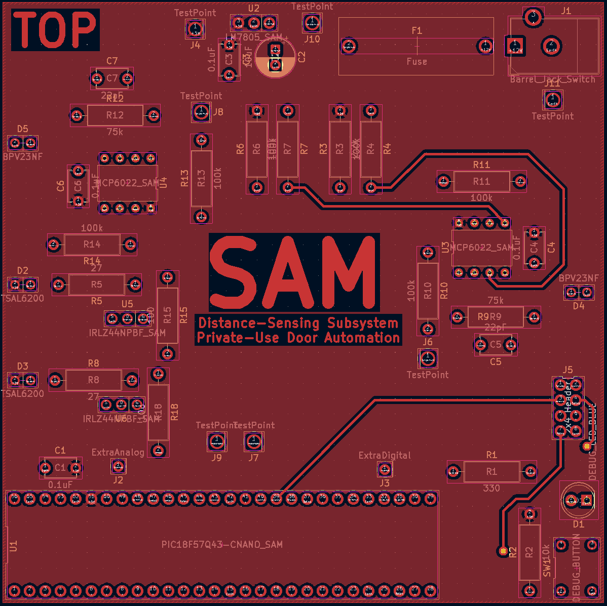

## Description

This page shows the design of the Printed Circuit Board for the Distance-Sensing subsystem. The purpose of this design is to convert the symbolic electrical schematic into a physically-accurate representation of the circuit board. It is the last phase of the design before physical parts are manufactured and put together. The board is composed of two copper layers- top and bottom. Each component has a specified place on the top layer with pads(isolated copper circles with holes) for each pin to be placed through and soldered to. The top layer is linked to the 5V power source and all pads connected to it. The bottom layer is linked to the GND source and all GND pads. All other pads are connected by copper traces on either side of the board which are isolated from the rest of the copper. Files are generated from this design and sent out as instructions for the PCB to be manufactured.

## PCB Top Side

This image shows the top layer of the PCB.

## PCB Bottom Side

This image shows the bottom layer of the PCB.

## Resouces

The PCB front and back images as a PDF download are available [*here*](IndividualSubsystemDesignPCB.pdf), and a Zip folder of the ECAD project [*here*](EGR304-IndividualSubystemDesign.zip).

The Gerber files used for manufacturing of the PCB are available [*here*](Merwin.Seth.103.zip).